# 故障排除指南

AI 量化系统常见问题诊断和解决方案

## 故障排除总体流程

### 1. 问题分类

| 类型          | 症状                   | 优先级 |
| ------------- | ---------------------- | ------ |
| 🔴 **系统级** | 服务无法启动、系统崩溃 | 紧急   |
| 🟡 **功能级** | 特定功能异常、数据错误 | 高     |
| 🟢 **性能级** | 响应慢、资源占用高     | 中     |
| 🔵 **配置级** | 环境配置、参数调整     | 低     |

### 2. 诊断步骤

```mermaid
graph TD
    A[问题报告] --> B[收集日志信息]
    B --> C[检查系统状态]
    C --> D[定位问题范围]
    D --> E{问题类型}
    E -->|系统级| F[系统故障处理]
    E -->|功能级| G[功能故障处理]
    E -->|性能级| H[性能问题分析]
    E -->|配置级| I[配置问题修复]
    F --> J[验证修复结果]
    G --> J
    H --> J
    I --> J
    J --> K[文档记录]
```



## 系统级故障处理

### 1. 服务启动失败

#### 🔴 症状

- Docker 容器启动失败
- 应用进程无法启动
- 端口绑定错误

#### 🔍 诊断命令

```bash
# 检查容器状态
docker-compose ps

# 查看容器日志
docker-compose logs app

# 检查端口占用
netstat -tulpn | grep :8000
lsof -i :8000

# 检查系统资源
df -h
free -h
top
```

#### ⚡ 解决方案

**端口占用问题**:

```bash
# 查找占用进程
sudo netstat -tulpn | grep :8000

# 终止进程
sudo kill -9 <PID>

# 重启服务
docker-compose restart app
```

**资源不足问题**:

```bash
# 清理Docker资源
docker system prune -af
docker volume prune -f

# 清理日志文件
sudo truncate -s 0 /var/log/syslog
find logs/ -name "*.log" -exec truncate -s 0 {} \;
```

**配置文件错误**:

```bash
# 检查配置文件语法
python -c "from backend.app.core.config import get_settings; print(get_settings())"

# 重置配置文件
cp env.template .env
# 重新编辑配置
```

### 2. 数据库连接失败

#### 🔴 症状

- 应用无法连接数据库
- 数据库查询超时
- 连接池耗尽

#### 🔍 诊断命令

```bash
# 检查PostgreSQL状态
docker-compose exec postgres pg_isready -U ai_quant_user

# 测试数据库连接
psql -h localhost -p 5432 -U ai_quant_user -d ai_quant_db

# 检查连接数
psql -c "SELECT count(*) as connections FROM pg_stat_activity;"
psql -c "SELECT * FROM pg_stat_activity WHERE state = 'active';"
```

#### ⚡ 解决方案

**连接超时问题**:

```bash
# 检查网络连通性
ping postgres_container_ip

# 调整连接池配置
# 在.env文件中增加:
DB_POOL_SIZE=20
DB_MAX_OVERFLOW=0
DB_POOL_TIMEOUT=30
```

**连接数过多**:

```sql
-- 查看连接详情
SELECT pid, usename, application_name, client_addr, state, query_start
FROM pg_stat_activity
WHERE state = 'active';

-- 终止空闲连接
SELECT pg_terminate_backend(pid)
FROM pg_stat_activity
WHERE state = 'idle' AND query_start < now() - interval '30 minutes';
```

**权限问题**:

```sql
-- 检查用户权限
\du ai_quant_user

-- 重新授权
GRANT ALL PRIVILEGES ON DATABASE ai_quant_db TO ai_quant_user;
GRANT USAGE ON SCHEMA public TO ai_quant_user;
GRANT ALL ON ALL TABLES IN SCHEMA public TO ai_quant_user;
```

### 3. Redis 连接问题

#### 🔴 症状

- 缓存服务不可用
- Redis 内存溢出
- 数据持久化失败

#### 🔍 诊断命令

```bash
# 检查Redis状态
docker-compose exec redis redis-cli ping

# 查看Redis信息
docker-compose exec redis redis-cli info

# 检查内存使用
docker-compose exec redis redis-cli info memory
```

#### ⚡ 解决方案

**内存溢出问题**:

```bash
# 清理过期键
docker-compose exec redis redis-cli --scan --pattern "*" | xargs docker-compose exec redis redis-cli del

# 调整内存配置
# 在redis.conf中设置:
maxmemory 1gb
maxmemory-policy allkeys-lru
```

**持久化失败**:

```bash
# 检查磁盘空间
df -h

# 手动触发保存
docker-compose exec redis redis-cli bgsave

# 检查AOF文件
docker-compose exec redis redis-cli info persistence
```

## 功能级故障处理

### 1. 数据获取异常

#### 🟡 症状

- AKShare API 调用失败
- 数据返回为空
- 数据格式错误

#### 🔍 诊断步骤

```bash
# 测试AKShare连接
python3 -c "
import akshare as ak
try:
    df = ak.stock_info_sh_name_code()
    print(f'获取到 {len(df)} 条数据')
except Exception as e:
    print(f'错误: {e}')
"

# 检查网络连接
curl -I https://akshare.akfamily.xyz/

# 查看应用日志
docker-compose logs app | grep -i "akshare\|error"
```

#### ⚡ 解决方案

**API 限流问题**:

```python
# 调整重试配置
RETRY_CONFIG = {
    "max_retries": 5,
    "delay": 2.0,
    "backoff": 2.0,
    "max_delay": 60.0
}
```

**网络问题**:

```bash
# 配置代理（如果需要）
export http_proxy=http://proxy.company.com:8080
export https_proxy=http://proxy.company.com:8080

# 或在docker-compose.yml中添加：
environment:
  - http_proxy=http://proxy.company.com:8080
  - https_proxy=http://proxy.company.com:8080
```

**数据格式问题**:

```python
# 添加数据验证
def validate_stock_data(df):
    required_columns = ['日期', '开盘', '收盘', '最高', '最低', '成交量']
    missing_cols = [col for col in required_columns if col not in df.columns]
    if missing_cols:
        raise ValueError(f"缺少必要列: {missing_cols}")
    return True
```

### 2. 数据存储异常

#### 🟡 症状

- Parquet 文件损坏
- 数据写入失败
- 查询结果不一致

#### 🔍 诊断步骤

```bash
# 检查存储目录权限
ls -la data/parquet/

# 测试Parquet文件完整性
python3 -c "
import pandas as pd
import os
for root, dirs, files in os.walk('data/parquet'):
    for file in files:
        if file.endswith('.parquet'):
            try:
                df = pd.read_parquet(os.path.join(root, file))
                print(f'✓ {file}: {len(df)} rows')
            except Exception as e:
                print(f'✗ {file}: {e}')
"

# 检查磁盘空间
df -h data/
```

#### ⚡ 解决方案

**文件权限问题**:

```bash
# 修复权限
sudo chown -R $(whoami):$(whoami) data/
chmod -R 755 data/
```

**磁盘空间不足**:

```bash
# 清理旧数据
find data/parquet -name "*.parquet" -mtime +90 -delete

# 启用压缩
# 在存储配置中启用压缩：
PARQUET_COMPRESSION = "snappy"
```

**文件损坏修复**:

```python
# 数据恢复脚本
def repair_parquet_file(file_path):
    try:
        df = pd.read_parquet(file_path)
        # 重新保存修复
        df.to_parquet(file_path + ".repaired", compression='snappy')
        os.rename(file_path + ".repaired", file_path)
        print(f"修复成功: {file_path}")
    except Exception as e:
        print(f"无法修复: {file_path}, 错误: {e}")
```

### 3. API 响应异常

#### 🟡 症状

- 请求超时
- 返回 500 错误
- 数据格式不正确

#### 🔍 诊断步骤

```bash
# 测试API端点
curl -v http://localhost:8000/api/v1/health/ping

# 检查API日志
docker-compose logs app | grep -E "(ERROR|500|timeout)"

# 性能测试
ab -n 100 -c 10 http://localhost:8000/api/v1/health/ping
```

#### ⚡ 解决方案

**超时问题**:

```python
# 调整超时配置
TIMEOUT_CONFIG = {
    "request_timeout": 60,
    "database_timeout": 30,
    "redis_timeout": 5
}
```

**内存泄漏**:

```bash
# 监控内存使用
docker stats

# 重启应用清理内存
docker-compose restart app
```

## 性能问题分析

### 1. 响应时间慢

#### 🟢 症状

- API 响应时间 > 200ms
- 数据查询缓慢
- 页面加载慢

#### 🔍 性能分析

```bash
# API响应时间测试
curl -w "@curl-format.txt" -o /dev/null -s http://localhost:8000/api/v1/data/stocks/000001

# curl-format.txt内容:
#     time_namelookup:  %{time_namelookup}\n
#        time_connect:  %{time_connect}\n
#     time_appconnect:  %{time_appconnect}\n
#    time_pretransfer:  %{time_pretransfer}\n
#       time_redirect:  %{time_redirect}\n
#  time_starttransfer:  %{time_starttransfer}\n
#                     ----------\n
#          time_total:  %{time_total}\n

# 数据库查询分析
psql -c "SELECT query, mean_time, calls FROM pg_stat_statements ORDER BY mean_time DESC LIMIT 10;"
```

#### ⚡ 优化方案

**数据库优化**:

```sql
-- 创建索引
CREATE INDEX CONCURRENTLY idx_stock_symbol_date ON stock_data(symbol, date);

-- 分析表统计
ANALYZE stock_data;

-- 查看执行计划
EXPLAIN ANALYZE SELECT * FROM stock_data WHERE symbol = '000001';
```

**缓存优化**:

```python
# 增加缓存层
@cache.memoize(timeout=300)
def get_stock_data(symbol, start_date, end_date):
    return fetch_data_from_storage(symbol, start_date, end_date)
```

**代码优化**:

```python
# 异步处理
async def batch_process_stocks(symbols):
    tasks = [process_single_stock(symbol) for symbol in symbols]
    return await asyncio.gather(*tasks)
```

### 2. 内存使用过高

#### 🟢 症状

- 内存使用率 > 80%
- OOM 错误
- 容器重启频繁

#### 🔍 内存分析

```bash
# 检查容器内存使用
docker stats --no-stream

# Python内存分析
python3 -c "
import psutil
import os
process = psutil.Process(os.getpid())
print(f'内存使用: {process.memory_info().rss / 1024 / 1024:.1f} MB')
"

# 检查大对象
# 可以使用memory_profiler
pip install memory-profiler
python -m memory_profiler your_script.py
```

#### ⚡ 优化方案

**数据分批处理**:

```python
def process_large_dataset(data, batch_size=1000):
    for i in range(0, len(data), batch_size):
        batch = data[i:i + batch_size]
        yield process_batch(batch)
```

**内存限制配置**:

```yaml
# docker-compose.yml
services:
  app:
    deploy:
      resources:
        limits:
          memory: 4G
        reservations:
          memory: 2G
```

### 3. CPU 使用率高

#### 🟢 症状

- CPU 使用率 > 90%
- 系统响应慢
- 风扇高速运转

#### 🔍 CPU 分析

```bash
# 实时监控
htop

# CPU使用详情
pidstat -u 1

# Python性能分析
python -m cProfile -o profile.stats your_script.py
python -c "
import pstats
p = pstats.Stats('profile.stats')
p.sort_stats('cumulative').print_stats(10)
"
```

#### ⚡ 优化方案

**并发控制**:

```python
# 限制并发数
semaphore = asyncio.Semaphore(5)

async def rate_limited_task():
    async with semaphore:
        await actual_task()
```

**算法优化**:

```python
# 使用更高效的数据结构
from collections import deque
import bisect

# 预编译正则表达式
import re
pattern = re.compile(r'your_pattern')
```

## 配置问题修复

### 1. 环境变量配置

#### 🔵 常见配置错误

```bash
# 检查环境变量
printenv | grep -E "(DB_|REDIS_|SECRET_)"

# 验证配置
python3 -c "
from backend.app.core.config import get_settings
settings = get_settings()
print('数据库:', settings.DB_HOST)
print('Redis:', settings.REDIS_HOST)
print('密钥长度:', len(settings.SECRET_KEY))
"
```

#### ⚡ 配置修复

**数据库配置**:

```bash
# .env文件检查
cat .env | grep -v "^#" | grep -v "^$"

# 必要配置项
DB_HOST=postgres
DB_PORT=5432
DB_USERNAME=ai_quant_user
DB_PASSWORD=your_secure_password
DB_NAME=ai_quant_db
```

**安全配置**:

```bash
# 生成安全密钥
python3 -c "
import secrets
print('SECRET_KEY=' + secrets.token_urlsafe(32))
"
```

### 2. 日志配置

#### 🔵 日志问题诊断

```bash
# 检查日志目录
ls -la logs/

# 检查日志权限
ls -la logs/*.log

# 检查日志轮转配置
cat /etc/logrotate.d/ai-quant
```

#### ⚡ 日志配置修复

**日志权限修复**:

```bash
# 创建日志目录
mkdir -p logs
chmod 755 logs
touch logs/app.log
chmod 644 logs/app.log
```

**日志级别调整**:

```python
# 临时调整日志级别
import logging
logging.getLogger().setLevel(logging.DEBUG)

# 配置文件调整
LOG_LEVEL=DEBUG  # 调试时使用
LOG_LEVEL=INFO   # 生产环境使用
```

## 监控和预防

### 1. 健康检查脚本

```bash
#!/bin/bash
# health_check.sh

echo "=== AI量化系统健康检查 $(date) ==="

# API健康检查
echo "1. API健康检查..."
if curl -f -s http://localhost:8000/api/v1/health/ping > /dev/null; then
    echo "   ✓ API服务正常"
else
    echo "   ✗ API服务异常"
fi

# 数据库健康检查
echo "2. 数据库健康检查..."
if docker-compose exec -T postgres pg_isready -q; then
    echo "   ✓ 数据库正常"
else
    echo "   ✗ 数据库异常"
fi

# Redis健康检查
echo "3. Redis健康检查..."
if docker-compose exec -T redis redis-cli ping | grep -q PONG; then
    echo "   ✓ Redis正常"
else
    echo "   ✗ Redis异常"
fi

# 磁盘空间检查
echo "4. 磁盘空间检查..."
DISK_USAGE=$(df / | tail -1 | awk '{print $5}' | sed 's/%//')
if [ $DISK_USAGE -lt 90 ]; then
    echo "   ✓ 磁盘空间充足 ($DISK_USAGE%)"
else
    echo "   ⚠ 磁盘空间不足 ($DISK_USAGE%)"
fi

# 内存使用检查
echo "5. 内存使用检查..."
MEMORY_USAGE=$(free | grep Mem | awk '{printf "%.1f", $3/$2 * 100.0}')
echo "   内存使用率: $MEMORY_USAGE%"

echo "=== 健康检查完成 ==="
```

### 2. 自动化监控

```bash
#!/bin/bash
# monitor.sh

# 设置告警阈值
CPU_THRESHOLD=80
MEMORY_THRESHOLD=85
DISK_THRESHOLD=90

# 检查CPU使用率
CPU_USAGE=$(top -bn1 | grep "Cpu(s)" | awk '{print $2}' | cut -d'%' -f1)
if (( $(echo "$CPU_USAGE > $CPU_THRESHOLD" | bc -l) )); then
    echo "告警: CPU使用率过高 ($CPU_USAGE%)"
    # 发送告警通知
    curl -X POST "https://api.telegram.org/bot$BOT_TOKEN/sendMessage" \
         -d "chat_id=$CHAT_ID&text=AI量化系统CPU告警: $CPU_USAGE%"
fi

# 检查内存使用率
MEMORY_USAGE=$(free | grep Mem | awk '{printf "%.1f", $3/$2 * 100.0}')
if (( $(echo "$MEMORY_USAGE > $MEMORY_THRESHOLD" | bc -l) )); then
    echo "告警: 内存使用率过高 ($MEMORY_USAGE%)"
fi

# 定期运行监控
# 添加到crontab: */5 * * * * /path/to/monitor.sh
```

### 3. 预防性维护

```bash
#!/bin/bash
# maintenance.sh

echo "开始预防性维护..."

# 1. 清理日志
find logs/ -name "*.log" -size +100M -exec truncate -s 50M {} \;

# 2. 清理临时文件
find /tmp -name "tmp*" -mtime +7 -delete

# 3. 数据库维护
docker-compose exec -T postgres psql -U ai_quant_user -d ai_quant_db -c "VACUUM ANALYZE;"

# 4. Redis内存优化
docker-compose exec -T redis redis-cli MEMORY PURGE

# 5. Docker系统清理
docker system prune -f --volumes

echo "预防性维护完成"
```

## 紧急故障处理

### 应急响应流程

1. **立即响应** (5 分钟内)

   - 确认故障影响范围
   - 启动应急预案
   - 通知相关人员

2. **快速恢复** (15 分钟内)

   - 尝试服务重启
   - 切换备用方案
   - 数据回滚(如需要)

3. **根因分析** (1 小时内)

   - 收集故障证据
   - 分析根本原因
   - 制定修复方案

4. **修复验证** (4 小时内)
   - 实施修复方案
   - 全面功能测试
   - 性能验证

### 应急联系方式

```
运维团队: ops@company.com
开发团队: dev@company.com
24小时热线: +86-xxx-xxxx-xxxx

钉钉群: AI量化系统运维
微信群: 量化系统技术支持
```

---

**故障排除指南版本**: v1.0.0  
**更新时间**: 2024 年 12 月 09 日  
**维护团队**: 技术运维部
